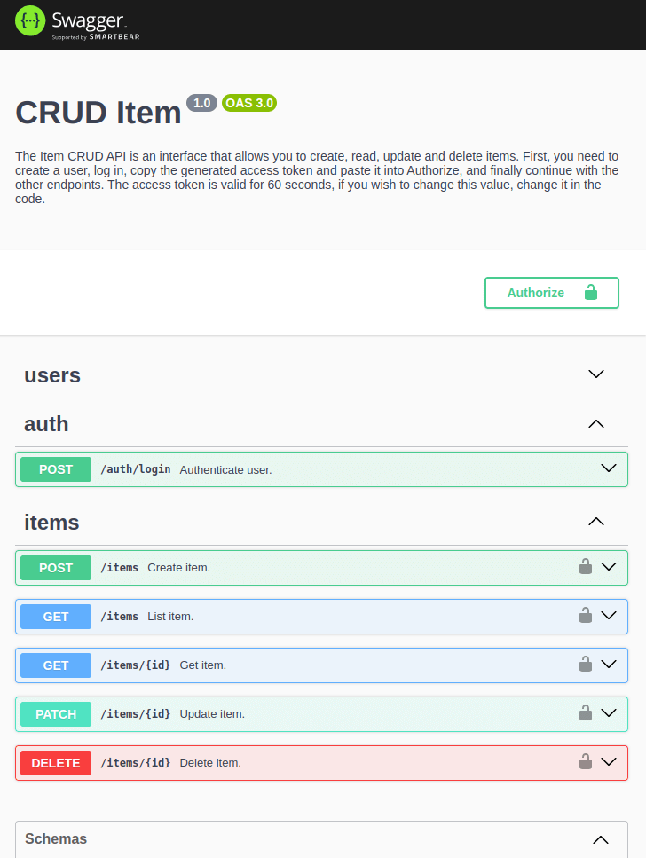

# CRUD Item
Este repositório contém um projeto CRUD simples, com autenticação básica, construído usando [NestJS](https://nestjs.com/). O objetivo deste repositório é praticar e compartilhar a possibilidade de construir todos os métodos CRUD com este framework.

## Tecnologias Utilizadas

- [NestJS](https://nestjs.com/) - Framework back-end que auxilia o desenvolvimento de aplicações eficientes. escaláveis e confiáveis em cima do Node.js.
  - [Mongoose](https://github.com/Automattic/mongoose) - Biblioteca de Modelagem de Dados de Objeto para MongoDB e Node.js.
  - [Bcrypt](https://github.com/kelektiv/node.bcrypt.js) - Biblioteca de auxilio a fazer hash de senhas.
  - [Passport](https://github.com/jaredhanson/passport) - Middleware de autenticação para Node.js.

## Instalação

1. Clonar o repositório:

```bash
$ git clone https://github.com/FCipolato/crud-item-back.git
```

2. Instalar dependências:

```bash
$ yarn install
```

## Banco de dados

1. O projeto usa MongoDB como banco de dados, sendo necessário subir localmente através do docker:

```bash
$ docker run -d --name mongodb -p 27017:27017 -e MONGO_INITDB_ROOT_USERNAME=root -e MONGO_INITDB_ROOT_PASSWORD=root mongo
```

## Execução

É possível executar o projeto de duas formas.

A. Localmente:

```bash
# desenvolvimento
$ yarn run start

# desenvolvimento watch mode
$ yarn run start:dev
```

B. Dockerfile:

```bash
# Passo 1
$ docker build --pull --rm -f "Dockerfile" -t cruditemback:latest "."

# Passo 2
$ docker run --rm -d -p 3000:3000/tcp cruditemback:latest 
```

## API Endpoints
A API fornece os seguintes endpoints:

```markdown
POST /users/signup - Criar usuário.

POST /auth/login - Logar usuário.

POST /items - Registrar um novo item.

GET /items - Recuperar uma lista de todos os itens.

GET /items/{id} - Recuperar uma item de acordo com seu id.

PATCH /item/{id} - Alterar um item.

DELETE /item/{id} - Deletar um item.
```

## Funcionamento

É necessário primeiro criar um novo usuário através do endpoint `POST /users/signup`, após isso todos os outros endpoints estarão disponíveis para serem acessados.

Mais informações sobre a documentação das APIs encontram-se no swagger da aplicação:

```markdown
http://localhost:3000/api
```

<h1 align="center">
  
</h1>

### Frontend

Você pode executar o frontend para se comunicar com esta aplicação através de requisições HTTP. Para isso, siga as instruções do repositório em que ele se encontra:

```markdown
https://github.com/FCipolato/crud-item-front
```